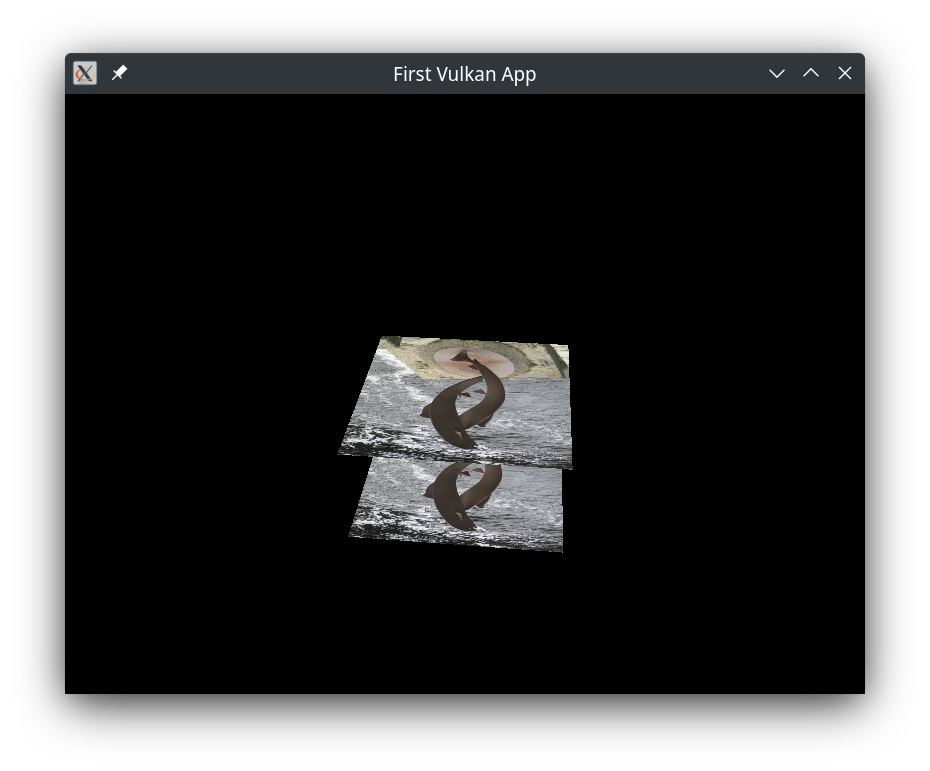

# Vulkan project
Simple vulkan app that renders two projected rotating rectangles with texture applied on them.

## Resources
- [Vulkan Tutorial](https://vulkan-tutorial.com/)
- [Salmon Sculpture Texture](https://commons.wikimedia.org/wiki/File:Spawning_salmon_sculpture,_Wetherby_(16th_October_2020).jpg)

## External libraries
- [STB (stb_image.h)](https://github.com/nothings/stb/blob/master/stb_image.h)
- [Tiny obj loader (tiny_obj_loader.h)](https://github.com/tinyobjloader/tinyobjloader/blob/release/tiny_obj_loader.h)
- [Efertiti's bust by C. Yamahata](https://sketchfab.com/3d-models/nefertitis-bust-like-in-the-museum-ce5b14926e494558ab584375a8d63ca7)
