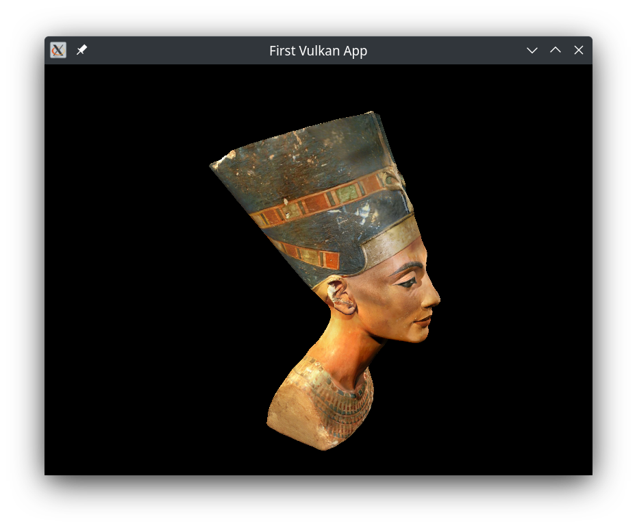

# Vulkan project
Simple vulkan app that renders a model Nefertiti bust. It implements features as:
- Multisampling,
- Mipmapping,
- Depth buffering.



## Requirements
To compile this project, following libraries have to be installed:
- [Vulkan SDK](https://github.com/LunarG/VulkanTools)
- [Vulkan Validation Layers](https://github.com/KhronosGroup/Vulkan-ValidationLayers)

On arch-like systems following command installs them both:
```bash
pacman -S vulkan-devel glslang
```
## Compilation
To compile the project using CMake:
```
git submodule update --init --recursive
mkdir build && cd build
cmake ..
make -j${nprocs}
./vulkan_project
```

## Resources
- [Vulkan Tutorial](https://vulkan-tutorial.com/)
- [Nefertiti's bust by C. Yamahata](https://sketchfab.com/3d-models/nefertitis-bust-like-in-the-museum-ce5b14926e494558ab584375a8d63ca7)

## External libraries
- [STB (stb_image.h)](https://github.com/nothings/stb/blob/master/stb_image.h)
- [Tiny obj loader (tiny_obj_loader.h)](https://github.com/tinyobjloader/tinyobjloader/blob/release/tiny_obj_loader.h)
- [GLFW](https://github.com/glfw/glfw)
- [GLM](https://github.com/g-truc/glm)
